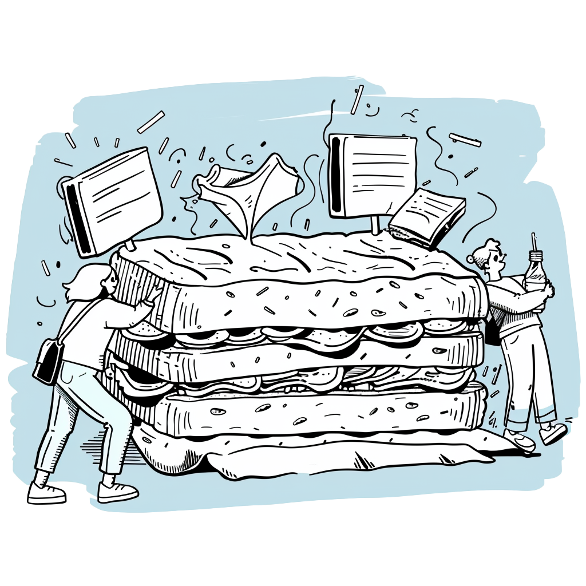

import authorImage from '@/images/team/drake-ballew.jpg'

export const article = {
  date: '2024-05-17',
  title: 'A/B Testing & Shit Sandwiches',
  description:
    'A short blog post on a common misconception among startup founders.',
  status: "published",
  author: {
    name: 'Drake Ballew',
    role: 'Owner-Operator',
    image: { src: authorImage },
  },
}

export const metadata = {
  title: article.title,
  description: article.description,
}

In the world of early stage startups, many founders obsess over metrics. Every decision must be data-driven. While not always helpful, most of the time this worldview is at least not harmful. But one area where it can be harmful, especially in early-stage Growth, is A/B testing.

A thought experiment to help elucidate the point: Let’s say you have two sandwiches. One is a McChicken. The other is a Shit Sandwich. Which one do you eat? Should we run an A/B test to make sure your decision is data-driven?

Early-stage product flows are almost always shit sandwiches. Don’t get in your own way by taking a big bite out of one just to make sure, as you suspected, it is in fact shit. Just eat the McChicken.