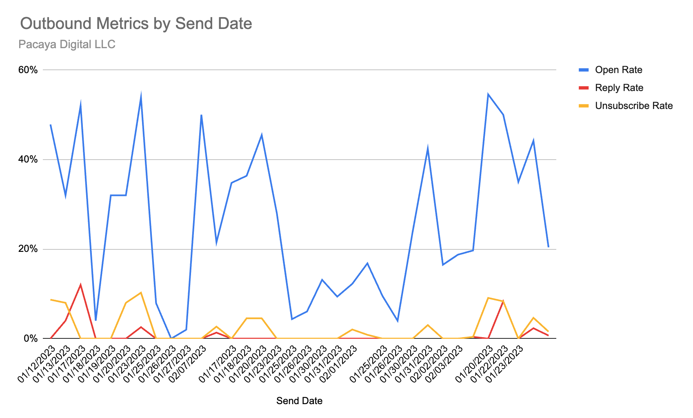

import authorImage from '@/images/team/drake-ballew.jpg'

export const article = {
  date: '2023-02-03',
  title: 'Cold Email Reporting',
  description:
    'Example of a cold email analysis that helps uncover deliverability issues.',
  status: "published",
  author: {
    name: 'Drake Ballew',
    role: 'Owner-Operator',
    image: { src: authorImage },
  },
}

export const metadata = {
  title: article.title,
  description: article.description,
}

Email is a notoriously opaque channel. Sales and marketing leaders often execute campaigns with little to no understanding of the extent to which one of their most fundamental assumptions is true: are my emails reaching the audience inbox?

Testing this assumption at any meaningful scale is difficult. Software like Postmaster Tools, MxToolbox, GlockApps, etc offer some insight, but the algorithms employed by ESPs are not always consistent and especially so with the young domains typically employed by early-stage startups.

As a result, sales/marketing/growth leaders at young companies are often flying blind with limited understanding of whether their early benchmark metrics are valid and how they are evolving over time. Luckily, fixing this issue is straightforward.

## Example Deliverability Report

If you're an early-stage startup, your best bet for understanding whether you're hitting the inbox is to set and warm up a new domain or subdomain, start fresh at very low volume, and monitor your non-warming open rate on a daily basis.

The report should look something like this:

This example is from a client who was just starting out and was struggling with SPAM, which is why open rate by day is so variable.

Over time, you are hoping to develop smoother curves. You expect open rate to be decaying over time, with reply rate improving due to testing and unsubscribe remaining near zero. For open rate, the question is how quickly it decays and by how much. This is a judgment call, and the uncertainty here is why you always want to have one fully warmed backup domain/subdomain.

## The Underlying Data

Most Sales Automation software will offer the ability to export send data - if your current provider doesn't, you should consider switching. With your raw sending data in hand, you'll want to pivot it into a summary table and do a little cleanup to get the daily rates you want.

Here is a [Google Sheet](https://docs.google.com/spreadsheets/d/1_pfAe22b6l0UuA9bGjMo8ilqWW2JmDiywjMFWJy1A10/edit?usp=sharing) with examples of the necessary charts and tables. You should be able to view and duplicate it.

## Summary 

That's really all there is to it. For an early-stage startup with a clean sending reputation, this is a very good proxy for deliverability. You can augment it with tools like GlockApps Inbox Reports and others, but it's always best to rely on your own data as much as possible.

Someday, there will be actually good Sales Automation software that does this reporting for you..