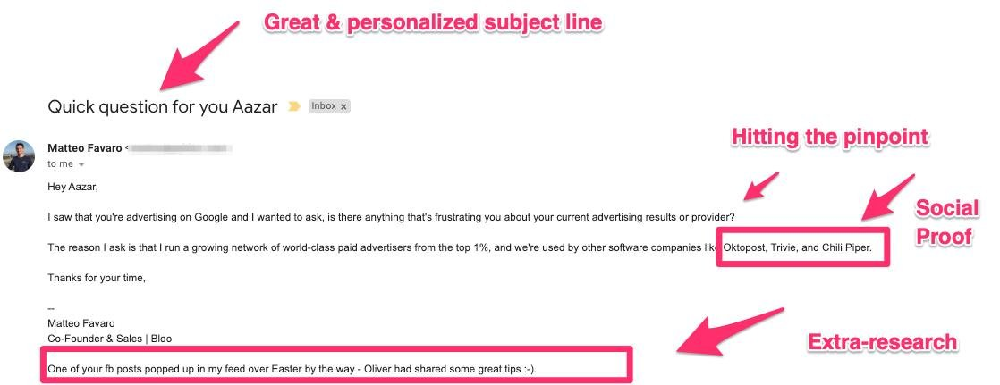
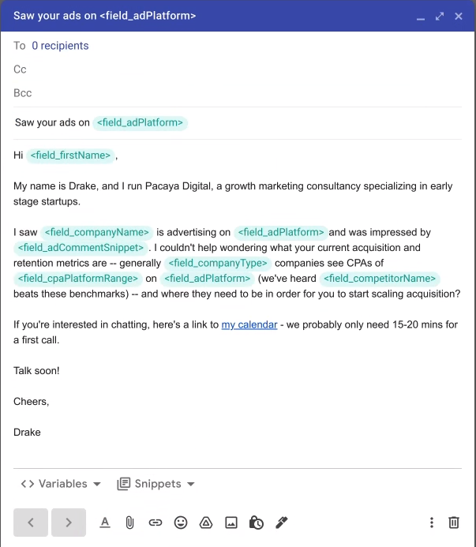

import authorImage from '@/images/team/drake-ballew.jpg'

export const article = {
  date: '2023-01-16',
  title: 'Cold Email For Startups',
  description:
    'High-level overview of how to get started with cold email as an outbound sales channel.',
  author: {
    name: 'Drake Ballew',
    role: 'Owner-Operator',
    image: { src: authorImage },
  },
}

export const metadata = {
  title: article.title,
  description: article.description,
}

Cold email is one of the best channels to get your startup off the ground. It’s easy to execute and often scales well with favorable economics.

This post will provide a high-level overview of how to think about cold email as your outbound sales/marketing evolves from pre-existence to when you’re ready to hire a team to manage the channel. It is primarily intended for early stage founders who are trying to get their first customers, though some of the advice may be useful to Marketing/Sales/Growth leads at later stage companies.

## Testing New Channels

At any given time with any given channel, you should do everything you can to de-risk further investment in the channel.

If you’re an early stage founder and are just getting started with a new channel, manage it yourself for a while in order to gather some initial data. You’ll be surprised by how much you can learn before you need to commit to a consultant or new hire in order to hit your growth targets.

The benefit of doing it yourself to start is that, as a founder, you’ve done the customer research and development to know better than anyone else who your customers are and what message(s) will resonate with them. Channel prioritization at this point is just about balancing reach x conversion against cost.

Eventually, however, the work generated by any successful channel will make it impossible for a founder to continue focusing on it - you will need to pay attention to the other parts of your business that are struggling to keep up with newfound demand. This is a good time to bring on a consultant since they are usually less expensive/risky than a full-time employee with equivalent experience or expertise, and you want to get things right rather than flounder as a junior hire figures things out.

Once you’ve hired the right consultant, set up goals with them that are tied to specific business outcomes (e.g. fundraising, profitability, etc) and leverage them to reach those goals. Once you reach the initial goal(s), it’s time to hire an expert with deep experience in your given channel into a full-time role (sometimes this can be the consultant themselves) and reassess your goals for the channel.

Following this process, you are minimizing your risk of further investment in a given channel every step of the way. This guide is about cold email, but you can and should apply this principle to any channel.

## Step 1 - Pre-Seed - Founder-Led Sales

For most small companies starting out with cold email, founder-led sales makes the most sense. Customers don’t know your company, and outreach from a cofounder (ideally the CEO) generates interest and replies better than anyone else.

Initially, the process will feel just like writing normal emails. You want to write and send 100% personally customized emails to your top prospects. You probably already have a list of 5-10 target accounts in your head. Go to LinkedIn, Instagram, personal/company blogs, press articles, etc and get the data you plan to reference in your emails -- this likely includes names, locations, titles, companies, content, etc. The one step that will be different than normal is that you want to organize it all in a Google Sheet (poor man’s CRM) for later reference.

This research process is tedious work, but testing the channel with the highest quality data -- collected manually by a customer expert -- will provide you the strongest signal for whether or not to further invest in the channel. Do this until you’re reaching out to 10-20 new prospects a day from your personal inbox (up to 100 new/week). This will take a significant amount of time so be sure to budget accordingly.

After 1-2 weeks, you should have enough feedback from replies and meetings booked to know whether you should refine your outreach copy or meeting/customer demo, or explore other channels entirely.

### On Initial Outreach Email Copy

Cold outreach should be friendly but not informal. A basic structure that I’ve seen a lot of success with is: Salutation, Personal Introduction, Company Introduction + Primary Value Proposition, Soft Ask, Sign Off.

In practice, this looks similar to the email that Aazar Shad received, and presumably responded to:                    

As you can see, the sender (Matteo) hits most of the major elements, albeit in a different order. One element he is missing is a soft ask (i.e. “Do you have 15 minutes to talk through your problems…?”). But his “P.S.” is an excellent example of personalization.

It’s also worth noting that I don’t really like the subject line. Your target recipient probably hates getting unsolicited cold email and has developed a sensitive bullshit detector to help avoid it. So doing something like putting prospect or company name in the subject line, while once effective, now days probably triggers the recipient’s bullshit detector more often than not. You can eventually split test subject line and copy changes like this, but paying attention and using your own inbox experience as a guide when you’re getting started is probably the best bet.

## Step 2 - Seed - Basic Operationalization

If the initial data looks promising, the next step is to invest in operationalizing cold email as a channel. To start, this can be broken down follows:

1. Boilerplate copy
2. List development
3. Sourcing prospects (scraping, buying, etc)
4. Augmenting with data for personalized outreach

Boilerplate copy is simple enough: take the copy of your manual outreach and standardize it into 1-2 general templates, with any personalization denoted as dynamic variables. Then go build and/or buy and augment a list that can meet the requirements of your email copy.                    

At this point, if you have enough prospects, it makes sense to increase your goal for weekly outreach from 100 new prospects/week to something closer to 400 new prospects/week. To do this without spending 100% of your time on the channel, you’ll need to outsource list development and any manual augmentation to Upwork, Fiverr, Pangaea or a similar platform.

It is also a good idea at this point to look into free/cheap sales software. Tools like MixMax, Streak, etc will make sending and measuring the effectiveness of your campaigns much easier. You’ll also want to run your leads through email verification software like Kickbox to make sure you’re only sending to legitimate inboxes.

<TopTip>
Be cautious when introducing sales automation tools. Resist the urge to send automated follow ups at this point. The risk of being marked spam is too high when you are sending from your primary domain. Just don’t do it.
</TopTip>

This process will give you a much better sense of the cost of cold email as the channel starts to grow. Depending on the extent of your personalization, prospects can be as cheap as $.10/prospect (basic LinkedIn contact info), all the way up to $2-3/prospect (custom snippets like “I read your blog post on XYZ - really loved your take on how analytics is set to evolve over the next five to ten years”).

Figuring out the Cost Per Prospect/Lead and Cost Per Acquisition curves is something you won’t have time for this early on. At such small scale, be biased toward spending more per lead (within reason) and the higher corresponding conversion rates, and just measure blended/average Cost Per Lead and Cost Per Acquisition.

If you are able to do all of this, you will have succeeded and will be able to demonstrate either that the cost of effective cold email is not viable, or you will have driven significant traction from cold email, possibly enough to raise a Seed/Series A round or at least enough to invest in bringing on someone to manage the channel so you can focus on other growth opportunities.

Step 3 - Series A - Hiring Sales Reps

If you’ve proven out/de-risked things sufficiently up to this point, hiring a consultant or FTE to manage cold email is an obvious next step. To hit your growth targets, you need to get out of the way and build/scale a basic sales process that doesn’t require your attention as an input.

But before you put your rep to work, there is some basic infrastructure you’ll want to put into place.

The first thing to do is spin up a subdomain for cold email outreach. The idea here is that you’re going to implement multi-touch cold email campaigns and you don’t want the inevitable spam complaints to affect your primary domain reputation or IP reputation. If you want to be extra cautious, you can also buy and warm up an entirely separate domain with its own subdomain(s). Make sure to set up SPF, DKIM, and DMARC on any domain/subdomain you plan to use for outreach.

With new domains/subdomains spun up, the next thing to do is set up new inboxes. You have a couple choices:

1. Create a burner CEO inbox that your sales rep can manage for you
2. Move things to your rep’s inbox(es)

There is no hard rule here. As discussed above, reaching out from a CEO/founder inbox will generally get more replies. The trick with using a burner inbox is in how to switch yourself out when it comes to the meeting - you’ll need to cc in your sales rep and pass the relationship to them, which adds another touch and may feel disappointing/jarring to your potential customer. In my experience, it’s easier to run things from a rep inbox - early customers will see value and convert regardless of whether it’s the CEO reaching out.

Next, you’ll want to start warming up your new inboxes (and thus domains) using a tool like MailWarm, Warmup Your Email, InboxAlly, etc. This process takes time (at least 3 weeks, ideally closer to 12 weeks) so you’ll want to make sure you start it as soon as possible. Importantly, after an inbox is fully warmed up, you’ll want to keep using the warmup tool as you start sending cold outreach in order to continue signaling strong engagement with emails being sent from the inbox.

After all this is done, you are now ready to start sending emails from your new, warmed up domain’s inboxes.

It’s now time to draft your follow-up copy (see below). If you’re not already, I recommend using sales productivity software like MixMax, Streak, Outreach, Tout, etc in order to follow up with your prospects. As previously noted, follow ups are not always appreciated, especially when they are poorly crafted, and are the primary culprit for spam complaints. Now that you are no longer sending from your primary domain or inbox, however, the cost of a given complaint is less severe and makes the tradeoff between an increased response rate and increased spam rate more favorable.

### On Follow-Up Email Copy**: 
Before you start scaling your first touch volume and adding follow-up emails to the mix, you will want to follow up manually in order to develop the templates you need to drive responses. It is a major mistake to follow up with “Just following up - did you get my last email?” or something of similarly low value to the recipient. Not only will follow ups like this not drive the vast majority of conversations forward, but they will result in spam complaints and deliverability issues.

At the very least, you want to show your prospects that you’ve done more research or given the issue of their potential interest more thought. Mention a blog post, recent press, or something else you’ve discovered about them. Talk about different product features and how they address the prospect’s problems. Don’t bump someone’s inbox asking for their attention with nothing new to say.

Just like with first-touch outreach, the reason you want to do this manually is because your follow-ups will be genuine - you will actually be doing the research - and thus this process will give you data on what your best-case metrics look like. Once you have a sense for what works, develop templates with variables and outsource the time-intensive research step to someone you trust.

Too often, sales reps get their hands on sales automation software and amplify a flawed/poor outreach sequence. Don’t do this. A good sequence should be indistinguishable from manual outreach.

With your full outreach sequence drafted, it’s time to start scaling your outreach. I have seen success in starting up to 200 new prospects per day in a given sequence, or sending around 3,000 emails/week from a given inbox, though this client had exceptional channel fit. I would recommend starting with closer to 50 new prospects per day and ramping from there, carefully monitoring your open and reply rates against your benchmark data.

Either way, be aware that the GSuite limit for a given inbox is 2,000 emails sent per day. So if you have a fully-ramped 10-step sequence with 200 new prospects per day, that will fully utilize your account. I do not recommend being so aggressive, but it illustrates that the only constraints from your side should be the breadth of your data sources and your budget. If you do a poor job, however, or are spamming prospects with low-value follow ups, your emails will be classified as spam and you’ll need to start over with a fresh subdomain.

Being marked spam is inevitable, and as outreach scales, channel performance will suffer. With data from your manual outreach as your benchmark, assume performance will degrade and model the cost/tradeoff curves so that you know when it is time to make wholesale changes.

The two wholesale changes that are most impactful/important are changing sender inbox and changing sending domain. If you are using GSuite, you can monitor the health of your sending domain via Postmaster Tools, though it is only somewhat reliable. It is trickier to monitor the health of a specific inbox, but you can back into it by monitoring the open rates on a per inbox basis over time. In fact, if Postmaster Tools is not working for you, open rates across inboxes will also be your best proxy for domain health.

Less fundamental but nonetheless still important are changes to your content, such as subject lines and body copy. Follow best practices here.

## Step 4 - Series B: Building a Sales Organization

If you’ve made it this far, your next move is to start building a sales team, likely starting with a Director or VP of Sales. What you’re looking for is someone who can take what you’ve already built, improve it, and add to it with structure and organization. Sales is both art and science, and ideally you’ll find someone who is skilled in both.

I’ve never scaled a Sales Org so can’t really talk to this part of the process, so I’ll wrap up here.

## Summary

In short, the main takeaways are to start manually as a founder and focus on only the most important metrics (e.g. booking rate). If things look good from there, start building things out, getting some help with the list building. Consider using some mail merge software to help make things smoother. If you follow up, do it manually. Start measuring things a bit more closely. If things still look good, hire a consultant,  invest in infrastructure, and start to scale things more seriously.

Final note: Before you do any of this, you should test whether email is the best channel to explore. If you can get the same booking rate from email as from a cold call, you should probably scale the phones rather than email, as it’s much simpler and has lower data acquisition cost.