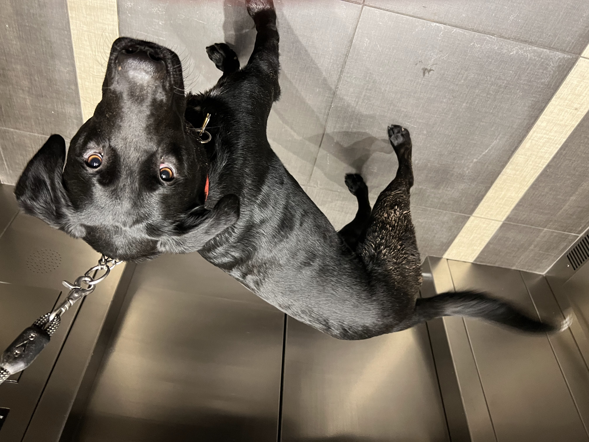

import authorImage from '@/images/team/akira.jpg'

export const article = {
  date: '2024-11-11',
  title: 'i wike chikin',
  description:
    'Today my birfday!!',
  author: {
    name: 'Akira',
    role: 'Quality Assurance Associate',
    image: { src: authorImage },
  },
}

export const metadata = {
  title: article.title,
  description: article.description,
}

Oh! Oh! Guess what?? Today my birfday! 🎉🐶 I THREE YEAR OLD! And hooman gave me… CHIKIN! BIG, JUICY, YUMMY CHIKEN!

I smells it soon as hooman open fridge, an’ my tail just go wiggle-wiggle-wiggle! Can’t believe all this CHICKEN FOR MEEE! I chomp chomp chomp it so fast, maybe too fast, but CHICEN TOO YUMMY TO WAIT!

Oh, best day EVER. First, big morning snuggles, then squeaky toy, an’ NOW CHICKN! What next?? Maybe belly rubs? Or more chiken?? Heehee!

Thank you, hoomans, for best birfday! Now I full, an’ I ready for NAPS. 💤 But don’t worry, I dream ‘bout more chicken.
