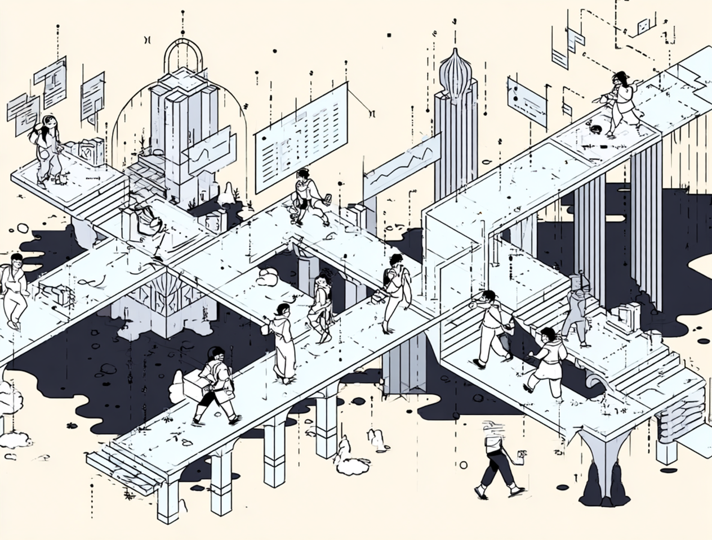

import authorImage from '@/images/team/drake-ballew.jpg'

export const article = {
  date: '2026-04-03',
  title: 'Vibes Are Eating the World',
  description:
    'Discusses implications of vibe coding.',
  status: "published",
  author: {
    name: 'Drake Ballew',
    role: 'Owner-Operator',
    image: { src: authorImage },
  },
}

export const metadata = {
  title: article.title,
  description: article.description,
}

I've been working for a few months now on a vibe-coded project, [OpenRecipe](https://openrecipe.ai), a project that I originally started working on with no-code tools, which I found to be extremely frustrating, and then started coding myself, which was painstakingly slow albeit satisfying. Vibe coding has unlocked the skills of a junior developer on meth for the mainstream, and I've found it to be incredibly satisfying to launch features in hours that would take me personally days or weeks to build.

All of that said, it's very clear as a fairly heavy user of vibe coding software that the AI assistant remains, like any computer, only as good as the person providing the prompt. Like computers running code, if the prompt is bad, the result will be bad. The problem with vibe coding, however, is that unlike code where it will simply break, the problems within vibe coded applications are significantly harder to find since, often, the AI assistant understands that the users wants a working app/feature/whatever, but they often don't understand how it should work on the first pass. And when I say often, I mean almost never.

So this brings up a few questions and realities for many (most?) software companies:

1. Vibe coding has significantly raised the bar for founders in terms of what is an acceptable MVP. In today's world, differentiation will be harder than ever for new companies since your competitors can build your app, its features, or anything else in days if not hours. The old Paul Graham adage that getting to and learning from the market is, in many ways, more valuable than developing software when it comes to building something people want is more true now than it has ever been before, at least in software.

2. Vibe coding will not replace programmers. The notion that programmers will be wholesale replaced is foolish. Instead, the amount of globally available data will continue to explode and software will continue to be developed to ingest, make sense of, and act upon it. Developers are going to be needed to build that software, and they will use AI assistants - likely "vibe coding" alongside them - to help them build it.

3. Branding and positioning - those old warhorses we took to the glue factory years ago that somehow survived - are more important than ever before. In a world where software and growth tactics can and will be copied, taste can't be copied. Branding and positioning are the business versions of taste.

4. There will be increased stratification within tech salaries. As teams shink because they are more productive, hiring will become more competitive and gaps between pay-bands will increase. I expect that hiring practices will become much more involved -- e.g. "build us your version of some app in 24 hours and walk us through it in detail" is a better jump-off point for an interview than 99.9999% of interview questions of the past and is a viable reality to ask of candidates now. This applies to all aspects of building in tech: "write a campaign plan," "draft a design system," etc. People will be hired based on their ability to think clearly and it will be easier to assess that ability than ever before, which will result in more optimal outcomes at least in terms of the top-of-funnel part of the human resources pipeline/problem. It will also result in the best people getting paid a lot more than the second best, third best, fourth best, etc. Expect increased inequality in tech pay and convincing justifications for it.

5. Security and QA are no longer an afterthought. The major slowdown (or *should* be a slowdown) in app development should be in security review. Imagine if any other product with real-world implications were launched without thorough security/QA review. You buy your Tesla, it auto-pilots you into a telephone pole: woops! Should have spent a few more days in QA. Same thing will apply with increasingly embarassing and costly examples within the software space. Expect data breaches to become commonplace. Expect people who install OpenClaw on their computers and hook it up to their toasters to have home fires that aren't covered by insurance. You get the drift. Until some adults step into the room (*ahem* Congress members, both federal and state) the foxes will be guarding the henhouse. Call me crazy, but I personally would not trust them to observe the better angels of their nature.

Anyway, just some off the cuff thoughts on vibe coding. Really amazing experience - the first thing in a long time that has made the internet feel magical again. But like the internet, the development of which was much slower, it will come with costs and tradeoffs. Expect there to be some serious growing pains as the world adapts.

