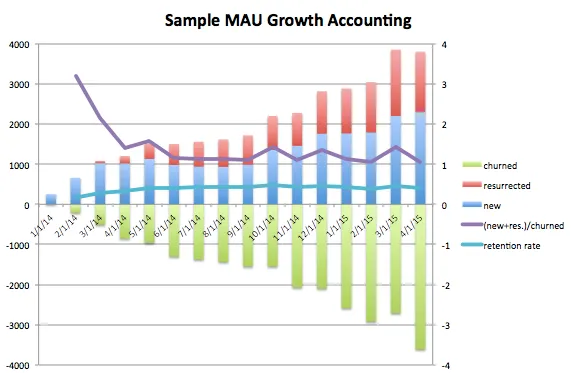
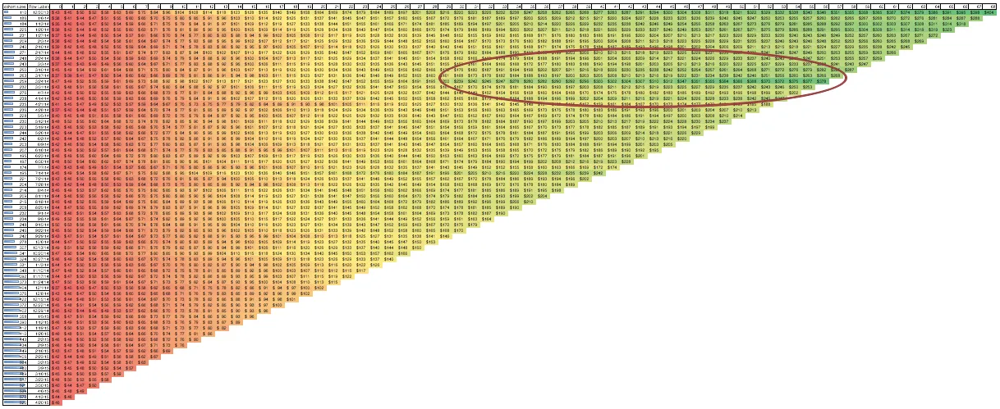
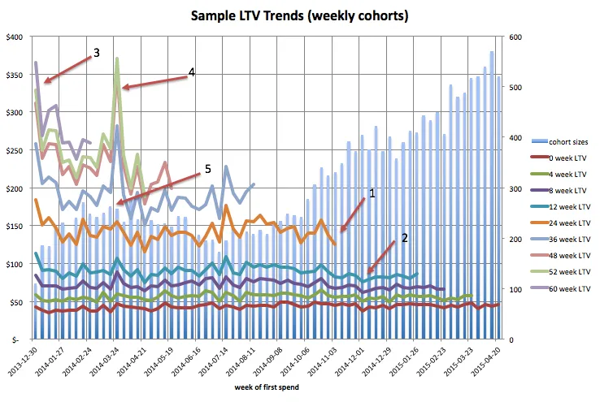

import authorImage from '@/images/team/drake-ballew.jpg'

export const article = {
  date: '2024-04-11',
  title: 'How to Measure Startup Growth',
  description:
    'Introduction to Growth Accounting, a framework for measuring growth.',
  author: {
    name: 'Drake Ballew',
    role: 'Owner-Operator',
    image: { src: authorImage },
  },
}

export const metadata = {
  title: article.title,
  description: article.description,
}

The foundation of any Analytics work is data infrastructure. Without the appropriate tooling, running these analyses will be harder and more resource-intensive than it should be. The cost of investing in Analytics at the earliest stages is low enough that it makes sense to do it from the outset.

I generally recommend startups invest in a data warehouse like Snowflake, an ETL tool like Fivetran, and a visualization layer like Lookr. More on that here. You can use whatever tools you like, but these are the basic elements for how to seamlessly perform the following analyses.

## What to Measure

The three components of growth that every startup needs to monitor are:

1. Users
2. Activity
3. Value

Users are the who. Depending on your business type, you may have multiple types of users. For instance, marketplaces generally have Demand-Side and Supply-Side users, and thus will need to measure growth of both types. The same concept applies to any business - think through your various user types and determine which user types to measure.

Activity is the what, and is specific to your business or application. Usually, a business has 1-3 core user activities that need to be monitored from the outset. As a rule of thumb, you want to measure the user behaviors most tightly correlated to the user’s value-realization. For eCommerce, these would be things like Add to Cart, Add Payment Info, and Checkout. For a social app, they would be things like Add a Friend, Send a Message, etc. For SaaS, they might be Invoices Sent, Emails Scheduled, Contacts Added, etc. The activity you need to measure is specific to your business and very important. Choose the user behaviors you want to focus on wisely.

Value is derived from Activity (you can think of it as a property of a given Action) and is fairly straightforward conceptually but the most difficult to measure. Value represents the dollar amount that a user is worth, whether historically, looking forward, or any other way you can imagine analyzing user value. For different businesses, value can be extremely hard to measure much less project. The most famous case is probably Facebook, which had an incredible amount of users and activity for its first few years but had no real idea of what that activity was worth (i.e. value). For other businesses, like general SaaS, if you have a product that users love, reflected by strong organic non-discounted User and Activity growth, Value is more closely tied to pricing and retention and thus much easier to model.

<TopTip>
The most common term you’ll hear around assessing value is Customer Lifetime Value (CLTV, or often just LTV). CLTV is a forward-looking metric that makes assumptions around the retention of user activity and the value of that activity over time and tries to boil it down into a single number to simplify the hard work of understanding a financial model in detail. It’s a helpful metric for communicating to people who either aren’t interested in or don’t have time to understand your business, but anyone who really cares will need to see the full model not just one metric.
</TopTip>

## Growth Accounting 101

There are infinite possible ways to measure User, Activity, and Value growth. Your startup will have its own set of important business-specific analyses, but when you are just starting out, it’s easier to start from a generalized template. Introducing Growth Accounting.

Growth Accounting is a term used to describe a methodology for measuring growth that accounts for all the various possible growth behaviors (e.g. new, churned, retained, resurrected, expanded, contracted, etc — often referred to as “Pirate Metrics”) over time. The term was traditionally used to describe a specific type of analysis, but Jonathan Hsu, Facebook’s former Head of Data Science turned VC, wrote an excellent multi-part summary in 2015 while he was at Social Capital and since then the term has been used more generally to describe a more forensic approach to growth analytics.

For the purposes of this primer, I will use the term “Growth Accounting” to describe what I believe to be the most important data visualizations for most early-stage startups. These should not be considered exhaustive or replacements for comprehensive visualization dashboards. Rather they should supplement more intuitive reporting on business metrics.

All of these analyses touch both Users and either Activity or Value. You can and should also make these analyses slice-able by various user, activity, and value (revenue) characteristics.

### Mixed Bar & Line, Growth Accounting

To measure user growth effectively, you will need to account for not just new users, but active users. And when you add “active” as a qualifier, it introduces the possibility for a user to change states. To accurately report on the growth of a user base with multiple user states, you will need Growth Accounting.

Here is an example of a Monthly Active User (MAU) Growth Accounting analysis:

Reading this chart is not as intuitive as a simple bar or line chart because it reports on growth - i.e. (Active users this period) - (Active users last period) - and shows you what caused that growth. If the areas above and below the X axis are equal for a given period, it means there was no growth. If one is larger than the other, it means you grew either positively or negatively. The purple line represents this ratio. Similarly, retained users and thus retention rate are not reflected in the bars but rather as a another line on the secondary Y axis.

### Retention Heat Map

Because the above analysis does not give much insight into retained user activity, you will want to complement it with a more in-depth look into retained activity, whether viewed as users, actions, or value.

The most common tool to look into retention is a classical heat map. In a heat map, rows generally represent time periods when users took some initial action, and columns represent time periods since where the same users either did or didn’t perform the same action.

Because heat maps always start at 100% activity for a cohort’s leftmost cell, you will generally see a degradation trend as the chart expands rightward. What you are looking for is positive or negative trends in the degradation.

For instance, if a given cohort’s activity degrades more slowly than others’, you will want to look at what changes you made that may have affected their retention rate. Similarly, if you notice a strong positive trend in your data, you will want to investigate and understand the cause to whatever extent possible.

### Mixed Bar & Line, LTV Trends

Another less intuitive view into your data is to look at past Activity trends. This is especially useful when analyzing Value over time for each of your cohorts, but you can run this analysis for any sort of Action.

Here is what an example LTV Trends analysis looks like:

Again, reading this chart takes a bit of upfront work. The bars are measured on the secondary Y axis and represent the size (in active users) of a given cohort. The lines represent snapshots of each cohort’s activity/realized value after a certain passage of time. This is why each consecutive line grows shorter as the chart ascends - if enough time has not elapsed, there will be no data to view.

As before, be sure to structure your data so that you can slice this analysis any number of ways. Generally speaking, larger cohorts will suffer depressed LTVs, but you will want to dig into the specifics for various user types, marketing channels, etc.

## Summary

Many early-stage startups waste an incredible amount of time running ad hoc analyses internally, for investors, etc. With a relatively small amount of forethought and investment in data infrastructure, you can answer the vast majority of your most pressing and important questions via Growth Accounting visualizations. And more importantly, you will be in a position to not just answer the most basic version of those questions — you will have a deep understanding of your users and their behavior as it relates to your business and product.