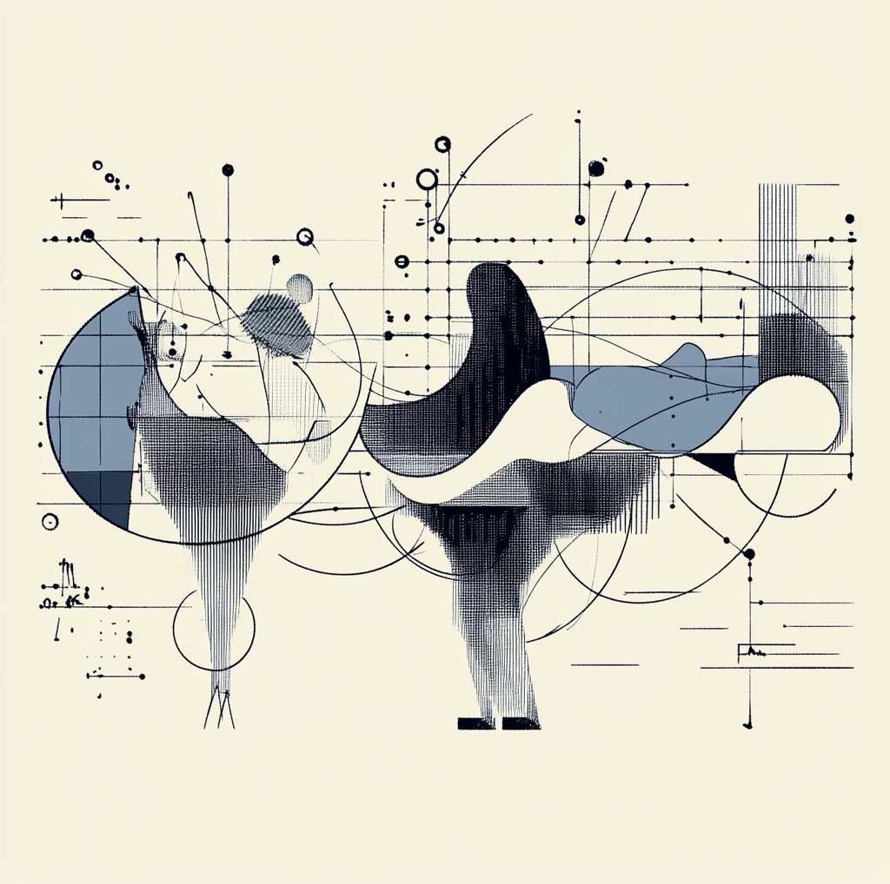

import authorImage from '@/images/team/drake-ballew.jpg'

export const article = {
  date: '2024-08-16',
  title: '1 + 1 ≠ 3',
  description:
    'An update to a common metaphor for describing teams.',
  author: {
    name: 'Drake Ballew',
    role: 'Owner-Operator',
    image: { src: authorImage },
  },
}

export const metadata = {
  title: article.title,
  description: article.description,
}

It always bothers me, for obvious reasons, when I see someone on LinkedIn use “1 + 1 = 3” as a metaphor for describing the idea that a team can produce more than the sum of its parts. The latter is true, and you don’t need room for disbelief to demonstrate it mathematically.

I’m sure that economists have worked productivity models out far more deeply than I can possibly imagine, but a simple update to the original equation produces the desired effect, at least for social media’s purposes:

$$
y = (1 + 1)^{1 + x}
$$

In the above equation, the parenthetical 1’s represent individual production in isolation, X represents a kind of “cohesion” variable, and Y represents output. You can see that if X is positive, the team will produce more than its component parts; if zero, exactly the sum of its component parts; and if negative, less than the sum of its component parts.

What might affect X? Leadership, hiring people with complementary hard skills and at least adequate soft skills, compensation structures, the list goes on…but basically, culture.

This simple if flawed update has far more explanatory power than Orwellian nonsense, and I recommend we update the way that us non-experts mathematically describe the output teams so that we don’t lose ourselves by way of our own imprecision.

For the record, in the above equation, X needs to be log2(3), or roughly .585, to equal 3. No Big Brother required!
